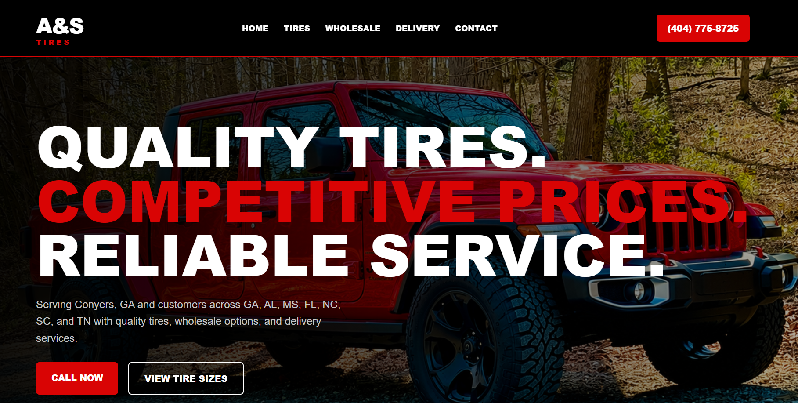
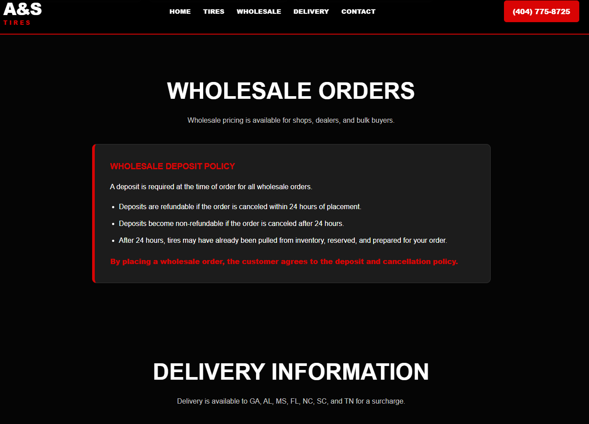
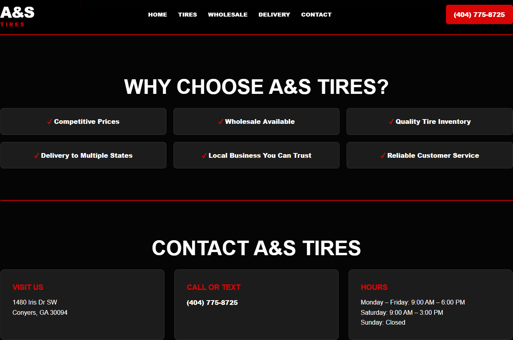

<p align="center">
  
</p>

<h1 align="center">✦ A&S Tires ✦</h1>

<p align="center">
<b>Wholesale Tire Business Website | Multi-State Delivery | Customer Quote Workflow</b>
</p>

<p align="center">
A responsive business website created for A&S Tires, a wholesale tire business offering tire sales, delivery service, quote requests, and ordering information for customers across multiple states.
</p>

---

## ✦ Live Demo

🌐 **Live Website**

https://angelacoreas1989-boop.github.io/as-tires/

---

## ✦ Project Overview

A&S Tires is a responsive business website designed for a tire wholesale and delivery company.

The website provides customers with a professional online experience where they can learn about services, review delivery coverage, understand ordering policies, and request pricing information.

---

## ✦ Business Problem

A&S Tires needed a professional online presence where customers could learn about wholesale tire services, understand delivery coverage, review ordering policies, and easily request pricing information.

Previously, customers primarily relied on phone calls and word-of-mouth referrals. The business needed a centralized location to showcase services, explain ordering requirements, and generate new customer inquiries.

---

## ✦ Solution

Developed a responsive business website that provides:

- Wholesale tire service information
- Multi-state delivery coverage details
- Customer quote request workflow
- Ordering and deposit policies
- Mobile-friendly navigation
- Direct contact options

The website gives customers a professional and convenient way to learn about services and request pricing information.

---

## ✦ Features

✔ Responsive business website design

✔ Wholesale tire service overview

✔ Multi-state delivery coverage

✔ Quote request section

✔ Contact information

✔ Ordering policy section

✔ Deposit policy explanation

✔ Mobile-friendly layout

✔ Professional business branding

✔ Customer-focused user experience

---

## ✦ Tech Stack

<p align="center">
  
</p>

<p align="center">
HTML • CSS • JavaScript • Git • GitHub • VS Code
</p>

---

## ✦ Website Preview

### Homepage



The homepage introduces customers to A&S Tires with professional branding, wholesale tire services, delivery coverage information, and clear contact options.

### Wholesale Services



Customers can learn about wholesale tire offerings, commercial services, delivery options, and the areas served throughout the Southeast.

### Quote & Contact



The quote and contact section allows customers to request pricing, review ordering policies, understand deposit requirements, and quickly connect with the business.

---

## ✦ Services & Coverage

A&S Tires provides wholesale tire services and delivery options for customers across multiple states.

Delivery coverage includes:

- Georgia
- Alabama
- Mississippi
- Florida
- North Carolina
- South Carolina
- Tennessee

---

## ✦ Order Policy

Wholesale orders may require a deposit at the time of order.

Deposits are refundable if the order is cancelled within 24 hours. After 24 hours, deposits become non-refundable due to restocking, labor, and preparation time.

---

## ✦ Skills Demonstrated

- Responsive Web Design
- Front-End Development
- UI/UX Design
- Mobile Optimization
- Business Requirements Gathering
- Client-Focused Development
- Content Organization
- Business Workflow Design
- GitHub Pages Deployment
- Professional Website Branding

---

## ✦ What I Learned

This project gave me experience building a website for a real wholesale business with specific customer service, delivery, and ordering requirements.

I learned how to organize business information clearly, present delivery coverage in a customer-friendly way, and create a website structure that supports quote requests and customer communication.

This project strengthened my ability to translate real business needs into a functional and professional website.

---

## ✦ Future Enhancements

- Online tire inventory catalog
- Tire size search feature
- Online quote request form
- Customer account portal
- Payment processing
- Order tracking
- Delivery scheduling
- Wholesale account registration
- Customer testimonials

---

## ✦ Project Structure

```text
as-tires/
│
├── index.html
├── style.css
├── script.js
│
├── assets/
│   ├── angela-coreas-banner.png
│   ├── as-tires-hero.jpg
│   ├── homepage.png
│   ├── services-wholesale.png
│   └── quote-contact.png
│
└── README.md

```

---

## ✦ CONNECT WITH ME ✦

<p align="center">

<a href="mailto:angelacoreas1989@gmail.com">

</a>

<a href="https://angelacoreas1989-boop.github.io/tech-portfolio/">

</a>

<a href="https://www.linkedin.com/in/angela-coreas">

</a>

<a href="https://github.com/angelacoreas1989-boop">

</a>

</p>

---

## ✦ AUTHOR ✦

<p align="center">
<b>Angela Coreas</b><br>
Software Engineering Student<br>
Transitioning into Tech Through Real-World Projects
</p>

<p align="center">
Building real-world projects while developing skills in software engineering, web development, and modern technology.
</p>

---

<p align="center">
Created for a small business client 🚛
</p>
