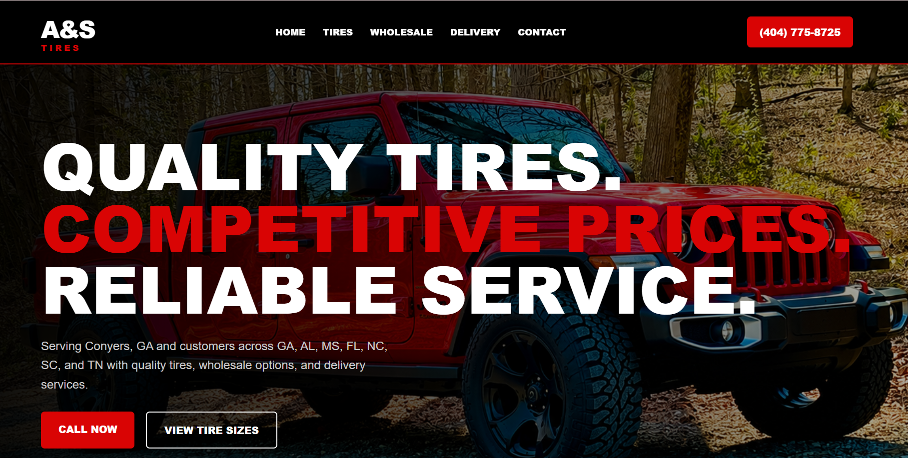
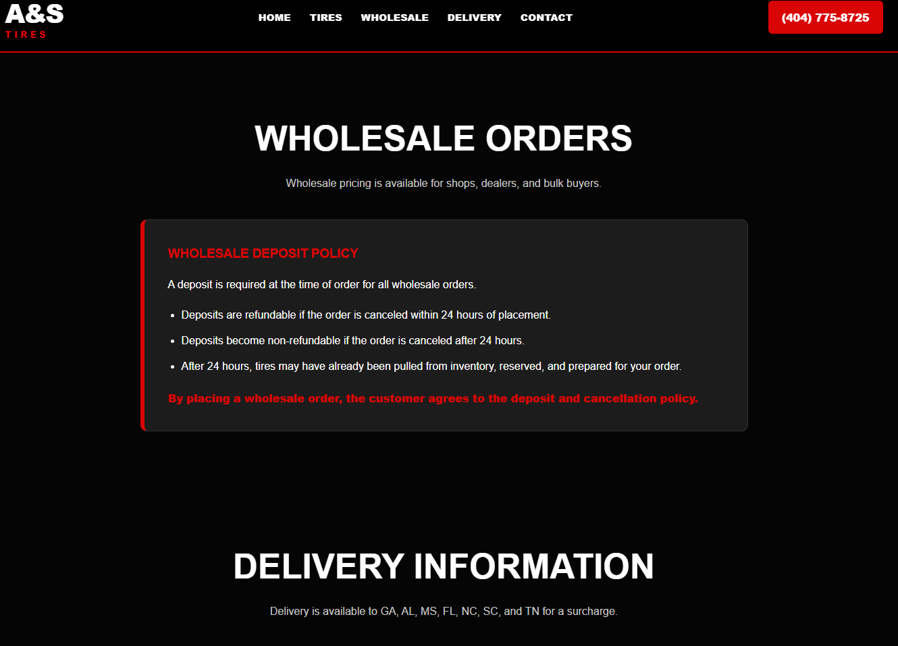
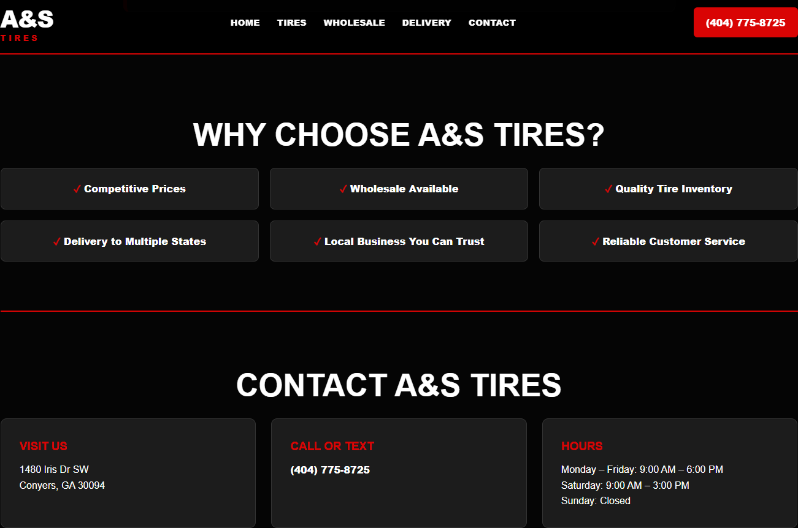

<p align="center">
  
</p>

<h1 align="center">✦ A&amp;S Tires ✦</h1>

<p align="center">
  <strong>Real Wholesale-Business Website • Service Discovery • Customer Inquiry Workflow</strong>
</p>

<p align="center">
  A responsive customer-facing website created for a wholesale tire business offering tire sales, multi-state delivery, pricing inquiries, and ordering information.
</p>

<br>

<p align="center">
  
  
  
  
</p>

<br>

<p align="center">
  <a href="https://angelacoreas1989-boop.github.io/as-tires/">
    
  </a>

  <a href="https://github.com/angelacoreas1989-boop/as-tires">
    
  </a>

  <a href="https://angelacoreas1989-boop.github.io/tech-portfolio/">
    
  </a>
</p>

---

## ✦ LIVE WEBSITE ✦

### [Explore A&S Tires](https://angelacoreas1989-boop.github.io/as-tires/)

This project was created for a real wholesale tire business using actual service, delivery, ordering, and customer-communication requirements.

---

## ✦ PROJECT OVERVIEW ✦

A&S Tires is a responsive business website designed for a wholesale tire sales and delivery company.

The website gives customers one central location where they can:

- Learn about wholesale tire services
- Understand who the business serves
- Review delivery coverage
- Learn about ordering requirements
- Review deposit and cancellation policies
- Request pricing information
- Contact the business

The project demonstrates how a service-based wholesale business can move from phone calls and word-of-mouth referrals toward a more organized online presence.

---

## ✦ THE BUSINESS PROBLEM ✦

A&S Tires primarily relied on direct conversations and word-of-mouth referrals to explain its services, delivery area, and ordering process.

Potential customers needed a centralized location where they could quickly determine:

- Whether A&S Tires offers the service they need
- Whether delivery is available in their state
- How wholesale ordering works
- Whether a deposit may be required
- How cancellation and refund policies work
- How to request pricing
- How to contact the business

Without a dedicated website, the business could receive repeated questions before a customer was ready to discuss an order.

---

## ✦ TARGET USERS ✦

### Primary Users

The website is intended for customers seeking wholesale tire purchasing and delivery information, including:

- Tire retailers
- Automotive businesses
- Commercial customers
- Fleet-related customers
- Resellers
- Other qualified wholesale buyers

### User Needs

A customer needs to:

- Understand the services offered
- Determine whether the business serves their location
- Review ordering expectations
- Understand deposit requirements
- Know how cancellations are handled
- Request pricing
- Contact the business for availability and order details

---

## ✦ THE SOLUTION ✦

I designed and developed a responsive website that serves as an informational and customer-inquiry hub for A&S Tires.

The website provides:

- Wholesale tire-service information
- Multi-state delivery coverage
- Ordering and deposit policies
- Cancellation information
- Pricing-inquiry guidance
- Direct contact options
- Responsive desktop and mobile layouts
- Professional business branding

The experience is organized around the questions a potential wholesale customer may need answered before contacting the business.

---

## ✦ CUSTOMER JOURNEY ✦

The primary customer journey follows these steps:

1. **Discover the business**  
   The customer is introduced to A&S Tires and its wholesale services.

2. **Understand the services**  
   The customer learns what the business provides and who it serves.

3. **Review delivery coverage**  
   The customer checks whether service may be available in their state.

4. **Understand ordering policies**  
   The customer reviews deposit, cancellation, and ordering expectations.

5. **Request pricing information**  
   The customer uses the available contact pathway to discuss tire availability and pricing.

6. **Confirm details directly**  
   The business confirms current inventory, pricing, delivery availability, deposits, and order requirements.

---

## ✦ DESIGN DECISIONS ✦

### Service Information Comes First

Wholesale services are introduced early so visitors can quickly determine whether the business may fit their needs.

### Visible Delivery Coverage

The delivery area is displayed clearly because location is one of the customer's most important questions.

### Policies Before Contact

Deposit and cancellation policies are presented before the customer begins an order discussion. This helps establish expectations earlier in the experience.

### Direct Contact Path

The website provides clear contact options instead of requiring customers to search through unrelated content.

### Professional Visual Identity

The layout, imagery, typography, and colors create a business-focused presentation appropriate for a wholesale and delivery company.

### Mobile-Friendly Design

Customers may access the website while working from a shop, warehouse, vehicle, or mobile device. The responsive layout keeps service and contact information available on smaller screens.

---

## ✦ KEY FEATURES ✦

### Business Information

- Wholesale tire-service overview
- Business introduction
- Professional online presence
- Customer-focused service descriptions
- Direct contact information

### Delivery Coverage

The website presents delivery information for:

- Georgia
- Alabama
- Mississippi
- Florida
- North Carolina
- South Carolina
- Tennessee

Delivery availability, timing, and requirements should be confirmed directly with the business.

### Ordering Information

- Wholesale-order expectations
- Deposit information
- Cancellation policy
- Refund conditions
- Customer inquiry guidance

### Customer Experience

- Responsive desktop and mobile layouts
- Clear navigation
- Organized service information
- Visible calls to action
- Pricing-inquiry pathway
- Professional business branding
- GitHub Pages deployment

---

## ✦ ORDER AND DEPOSIT INFORMATION ✦

Wholesale orders may require a deposit at the time of order.

As represented on the website:

- Deposits may be refundable when an order is canceled within 24 hours.
- After 24 hours, deposits may become nonrefundable due to restocking, labor, and preparation time.

Customers should confirm the current deposit, cancellation, refund, delivery, and ordering policies directly with A&S Tires before placing an order.

The website does not independently finalize orders or process payments.

---

## ✦ TECHNOLOGY STACK ✦

<p align="center">
  
</p>

<p align="center">
  HTML • CSS • JavaScript • Git • GitHub • VS Code • GitHub Pages
</p>

---

## ✦ SKILLS DEMONSTRATED ✦

### Front-End Development

- Semantic HTML
- Responsive CSS layouts
- JavaScript interactions
- Mobile optimization
- Content organization
- Git version control
- GitHub repository management
- GitHub Pages deployment

### User Experience

- Customer-journey planning
- Service-information organization
- Delivery-coverage presentation
- Policy visibility
- Clear calls to action
- Responsive interface design
- Business-focused content
- Customer inquiry workflow
- Information hierarchy
- Mobile-friendly navigation

### Client and Business Work

- Business-requirements gathering
- Client-focused development
- Translating business services into website content
- Organizing delivery and ordering information
- Presenting customer policies clearly
- Supporting a real customer-inquiry process
- Creating a professional business identity
- Designing for a service-based wholesale business

---

## ✦ WEBSITE PREVIEW ✦

### Homepage



**Highlights:**

- Professional business branding
- Wholesale tire-service introduction
- Delivery information
- Clear customer contact options

---

### Wholesale Services



**Highlights:**

- Wholesale service information
- Commercial customer focus
- Delivery coverage
- Business capabilities
- Customer-focused content

---

### Quote and Contact



**Highlights:**

- Pricing-inquiry pathway
- Contact information
- Ordering policies
- Deposit requirements
- Cancellation information

---

## ✦ CURRENT FUNCTIONAL LIMITATIONS ✦

The website currently serves as a business-information and customer-contact experience.

It does not currently include:

- Live tire inventory
- Tire-size search
- Real-time pricing
- Online ordering
- Secure customer accounts
- Payment processing
- Delivery scheduling
- Order tracking
- Automated wholesale-account approval

Customers must confirm current pricing, inventory, delivery availability, deposits, and order details directly with the business.

---

## ✦ ACCESSIBILITY CONSIDERATIONS ✦

The project considers accessibility through:

- Semantic page structure
- Clear section headings
- Alternative text for meaningful images
- Responsive layouts
- Readable content groupings
- Visible calls to action
- Consistent navigation
- Sufficient spacing between interactive elements
- Text-based delivery and policy information
- Mobile-friendly content

Accessibility remains an ongoing area of improvement as I continue learning and testing the website.

---

## ✦ WHAT I LEARNED ✦

This project gave me experience building a website for a real wholesale business with specific customer-service, delivery, and ordering requirements.

Through the project, I strengthened my ability to:

- Gather and organize business requirements
- Design around a client's operational needs
- Identify important customer questions
- Present delivery coverage clearly
- Organize ordering and deposit policies
- Create a customer inquiry pathway
- Build responsive page layouts
- Design for mobile users
- Create a professional business identity
- Translate business needs into website features
- Deploy and maintain a live website with GitHub Pages

---

## ✦ FUTURE ENHANCEMENTS ✦

### Customer Experience

- Conduct usability testing
- Document customer feedback and design revisions
- Improve keyboard navigation
- Improve screen-reader accessibility
- Add frequently asked questions
- Add customer testimonials
- Add clearer quote-request confirmation
- Add delivery-area lookup

### Wholesale Features

- Online tire inventory catalog
- Tire-size search
- Brand and category filters
- Live availability
- Online quote-request form
- Wholesale-account registration
- Customer account portal
- Saved orders and preferences

### Ordering and Delivery

- Secure payment processing
- Online deposits
- Order tracking
- Delivery scheduling
- Delivery-status updates
- Automated order confirmations
- Digital order agreements
- Cancellation-request workflow

---

## ✦ PROJECT STRUCTURE ✦

```text
as-tires/
├── assets/
│   ├── angela-coreas-banner.png
│   ├── as-tires-hero.jpg
│   ├── homepage.png
│   ├── services-wholesale.png
│   └── quote-contact.png
├── index.html
├── style.css
├── script.js
└── README.md
```

---

## ✦ EDUCATION ✦

**Western Governors University**

Bachelor of Science in Software Engineering  
Expected Graduation: June 2028

---

## ✦ DEVELOPER ✦

### Angela Coreas

Software Engineering Student • Operations and CRM Professional

**WGU Email:** acorea3@wgu.edu

**GitHub:**  
[github.com/angelacoreas1989-boop](https://github.com/angelacoreas1989-boop)

**LinkedIn:**  
[linkedin.com/in/angela-coreas-550088186](https://www.linkedin.com/in/angela-coreas-550088186)

**Portfolio:**  
[angelacoreas1989-boop.github.io/tech-portfolio](https://angelacoreas1989-boop.github.io/tech-portfolio/)

---

<p align="center">
  <strong>✦ Building Thoughtfully • Learning Continuously • Designing for Real Users ✦</strong>
</p>

<p align="center">
  <em>💗 Created for a real wholesale-business client and inspired by real customer needs. 🚛</em>
</p>
